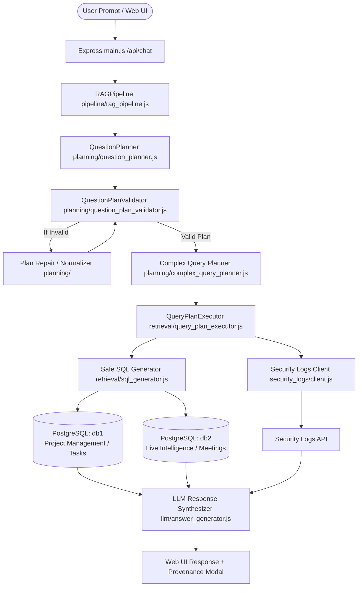

# AGENTS.md - CenarioCG Project & Architecture Guide for AI Agents

> **Project Name:** CenarioCG  
> **Type:** Multi-Source Retrieval-Augmented Generation (RAG) & Security Intelligence System  
> **Primary Stack:** Node.js (Express, PostgreSQL via `pg`, OpenAI SDK, ES Modules), JavaScript/React (Vite UI)  
> **Archive:** Original Python implementation archived under `older files/` at the project root  

---

## 1. System Overview & Purpose

**CenarioCG** is an agentic, multi-source RAG system designed to answer complex user queries across multiple heterogeneous project management databases (`db1`, `db2`) and a Security Logs API (`security_logs`).

The entire backend is implemented in **Node.js (ES Modules)**, utilizing:
- **LLM-driven Question Planner** (`backend/planning/question_planner.js`)
- **Deterministic Schema Plan Validator** (`backend/planning/question_plan_validator.js`)
- **Query Plan & Dependency Graph** (`backend/planning/query_plan.js`, `backend/planning/complex_query_planner.js`)
- **Safe SQL Generator & Validator** (`backend/retrieval/sql_generator.js`, `backend/retrieval/sql_validator.js`)
- **Multi-Source Context Layer & Graph** (`backend/context/context_graph.js`, `backend/context/context_store.js`)
- **Execution & Provenance Engine** (`backend/retrieval/query_plan_executor.js`, `backend/tracing/source_tracker.js`)

All original Python files have been preserved verbatim in the root-level [**`older files/`**](file:///d:/CenarioCG/older%20files) directory.

---

## 2. High-Level System Architecture



---

## 3. Directory & Module Breakdown (Active Node.js Codebase)

| Directory / File | Description & Core Responsibilities |
|---|---|
| [`backend/main.js`](file:///d:/CenarioCG/backend/main.js) & [`backend/api/`](file:///d:/CenarioCG/backend/api) | **Express Application Server:** Exposes `/api/chat`, `/api/auth`, `/api/graph`, `/api/health`. Manages session auth, CORS, request validation, and trace metadata serialization. |
| [`backend/pipeline/`](file:///d:/CenarioCG/backend/pipeline) | **Central Orchestrator (`RAGPipeline`):** Controls end-to-end question planning, plan validation, multi-source execution, result aggregation, and final answer synthesis. |
| [`backend/planning/`](file:///d:/CenarioCG/backend/planning) | **Query Planning Subsystem:**<br>• `question_planner.js`: Generates single/multi-step execution contracts.<br>• `question_plan_validator.js`: Deterministically validates plans against context schema.<br>• `complex_query_planner.js`: Decomposes multi-source and cross-join questions into execution steps.<br>• `source_router.js`: Semantic routing across `db1`, `db2`, and `security_logs`.<br>• `query_plan.js`: Topological dependency graph for steps (`s1`, `s2`, `s3`). |
| [`backend/context/`](file:///d:/CenarioCG/backend/context) | **Context Layer:**<br>• `context_store.js`: Local storage access for schema context files (`context_db1.json`, `context_db2.json`).<br>• `context_builder.js`: Dynamic read-only PostgreSQL schema discovery compiler.<br>• `context_graph.js`: In-memory `MultiDiGraph` representation of tables, foreign keys, and business links.<br>• `context_manager.js`: Multi-turn conversational memory and entity persistence.<br>• `cross_source_inference.js`: Semantic cross-source candidate inference engine.<br>• `cross_source_evidence.js`: Read-only value-hash evidence collection.<br>• `cross_source_business_logic.js`: Deterministic validation rules for cross-database links. |
| [`backend/retrieval/`](file:///d:/CenarioCG/backend/retrieval) | **Database Query Engine:**<br>• `sql_generator.js`: Compiles step contracts into safe, parameterized PostgreSQL SQL.<br>• `sql_validator.js`: Strict AST/syntax read-only checks, sensitive field blocking, wildcard projection prevention.<br>• `retrieval_executor.js` & `query_plan_executor.js`: Executes read-only queries with cross-step parameter binding. |
| [`backend/security/`](file:///d:/CenarioCG/backend/security) | **Security Policies:** Policy rules for sensitive credential fields, evidence security, and outbound payload redaction. |
| [`backend/security_logs/`](file:///d:/CenarioCG/backend/security_logs) | **Security Intelligence Layer:** `client.js` and `retriever.js` provide read-only retrieval of SIEM security logs and user audit events. |
| [`backend/entity_resolution/`](file:///d:/CenarioCG/backend/entity_resolution) | **Entity Resolution Engine:** Resolves project codes (`AVID-4207`), user emails, and entity IDs across disparate databases. |
| [`backend/llm/`](file:///d:/CenarioCG/backend/llm) | **LLM Integration:** `openai_client.js`, `answer_generator.js`, and `evidence_manager.js` manage prompt formulation, structured output, and evidence synthesis. |
| [`backend/tracing/`](file:///d:/CenarioCG/backend/tracing) | **Provenance & Tracing:** `tracer.js`, `source_tracker.js`, and `trace_metadata.js` track step timings, SQL queries, row counts, and source cards. |
| [`frontend/`](file:///d:/CenarioCG/frontend) | **React 19 + Vite UI:** Web dashboard with interactive Cytoscape graph, conversational chat, and visual PostgreSQL provenance modals. |
| [`older files/`](file:///d:/CenarioCG/older%20files) | **Python Archive:** Complete original Python implementation preserved outside `backend/` and `frontend/`. |

---

## 4. Available Data Sources & Database Schemas

### **`db1` — Project Management & Tasks Database**
- **Core Tables:** `project_details`, `project_tasks`, `project_sub_tasks`, `project_milestones`, `tickets`, `project_change_orders`, `cde_workspaces`, `cde_provider_tasks`, `chat_rooms`, `recent_activities`, `users`, `company_contacts`, `project_stake_holders`.
- **Key Identifiers:** `project_details.id` (UUID), `project_details.project_id_display` (e.g. `XAZM-9573`), `users.id`, `project_tasks.id`.

### **`db2` — Project Intelligence & Meetings Database**
- **Core Tables:** `projects`, `meeting_summaries`, `action_items`, `sessions`, `transcripts`, `documents`, `epics`, `usage_llm_events`, `key_insights`, `users`.
- **Key Identifiers:** `projects.id` (UUID), `projects.project_id` / `projects.project_code` (e.g. `XAZM-9573`), `sessions.id`, `meeting_summaries.meeting_id`.

### **`security_logs` — SIEM & Security Log Service**
- **Resources:** `security_logs`, `cli_audit_logs`, `workspace_security_logs`, `security_overview`.

---

## 5. Critical Guidelines & Architectural Rules for AI Agents

> [!IMPORTANT]
> **1. STRICT READ-ONLY DATABASE ACCESS**
> All database connection pools (`getDb1Pool`, `getDb2Pool`) execute `SET SESSION CHARACTERISTICS AS TRANSACTION READ ONLY` on connection. Never create, modify, or run `INSERT`, `UPDATE`, `DELETE`, `DROP`, `ALTER`, or schema-altering SQL statements.

> [!TIP]
> **2. SCHEMA ACCURACY & QUALIFIED COLUMN HANDLING**
> - Always check column existence against `ContextStore` / `question_plan_validator.js`.
> - In `sql_generator.js`, qualified column names (`table.column`) are used for filter/join predicates, but stripped of table prefixes when producing SELECT alias output keys (`column`) to prevent dictionary key mismatches.
> - PostgreSQL type casting (`CAST({column} AS text) = ANY($1)`) must be used when binding string inputs against UUID key columns.

> [!NOTE]
> **3. SOURCE TRACE & PROVENANCE**
> All PostgreSQL retrieval results must include source metadata formatted with `source_type: "postgresql"` and `source_id: "db1"` or `"db2"` so the frontend modal (`App.jsx` `getSourceDetails`) renders the visual SQL trace card correctly.

---

## 6. Development & Verification Commands

When working in this codebase, run the following commands:

```bash
# Start Node.js backend server locally (port 8000)
cd backend && npm start

# Or in development watch mode:
cd backend && npm run dev

# Run automated Node.js test suite
cd backend && npm test

# Start React + Vite frontend dev server (port 5173)
cd frontend && npm run dev
```
