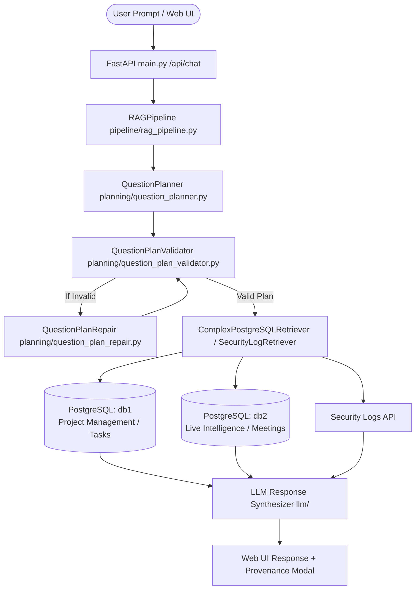

# AGENTS.md - CenarioCG Project & Architecture Guide for AI Agents

> **Project Name:** CenarioCG  
> **Type:** Multi-Source Retrieval-Augmented Generation (RAG) & Security Intelligence System  
> **Primary Stack:** Python (FastAPI, PostgreSQL, Pydantic), JavaScript/React (Vite UI), LLM Integration  

---

## 1. System Overview & Purpose

**CenarioCG** is an agentic, multi-source RAG system designed to answer complex user queries across multiple heterogeneous project management databases (`db1`, `db2`) and a Security Logs API (`security_logs`).

The system uses an **LLM-driven Question Planner**, a **Deterministic Schema Plan Validator**, an **Automated Plan Repair Engine**, and a **Safe SQL Generator** to execute read-only queries and synthesize natural language answers with full visual provenance (source trace buttons showing generated SQL queries and database metadata).

---

## 2. High-Level System Architecture



---

## 3. Directory & Module Breakdown

| Directory / File | Description & Core Responsibilities |
|---|---|
| `main.py` & `api/` | **FastAPI Application Server:** Exposes `/api/chat`, `/api/auth`, `/api/graph`. Manages session auth, request validation, and HTTP response streaming. |
| `pipeline/rag_pipeline.py` | **Central Orchestrator (`RAGPipeline`):** Controls the end-to-end question planning, plan validation, query execution, result aggregation, and final answer generation. |
| `planning/` | **Query Planning & Validation Subsystem:** <br>• `question_planner.py`: Generates structured single-step or multi-step execution plans.<br>• `question_plan_validator.py`: Deterministically validates plans against the Context Layer.<br>• `question_plan_repair.py`: Repairs invalid plans using schema context.<br>• `query_plan.py`: Dependency graph builder for step execution (`s1`, `s2`, `s3`). |
| `context/` | **Context Layer (`context_store.py`, `context_builder.py`):** Dynamically discovers and stores schema context (tables, columns, primary/foreign keys, business relationships) for `db1` and `db2`. |
| `retrieval/` | **Database Query Engine:** <br>• `sql_generator.py`: Compiles step contracts into parameterized, safe PostgreSQL SQL queries.<br>• `postgres_retriever.py` & `complex_postgres_retriever.py`: Executes read-only queries against PostgreSQL instances. |
| `security_logs/` | **Security Intelligence Layer:** `client.py` and `retriever.py` handle read-only retrieval of SIEM security logs and user audit events. |
| `entity_resolution/` | **Entity Resolution Engine:** Resolves project codes (`AVID-4207`), user emails, and entity IDs across different database schemas. |
| `frontend/` | **React + Vite UI:** Web dashboard with chat components, interactive source buttons, and PostgreSQL provenance modals (`App.jsx`). |

---

## 4. Available Data Sources & Database Schemas

### **`db1` — Project Management & Tasks Database**
- **Core Tables:** `project_details`, `project_tasks`, `project_sub_tasks`, `project_milestones`, `tickets`, `project_change_orders`, `cde_workspaces`, `cde_provider_tasks`, `chat_rooms`, `recent_activities`, `users`, `company_contacts`, `project_stake_holders`.
- **Key Identifiers:** `project_details.id` (UUID), `project_details.project_id_display` (e.g. `XAZM-9573`), `users.id`, `project_tasks.id`.

### **`db2` — Project Intelligence & Meetings Database**
- **Core Tables:** `projects`, `meeting_summaries`, `action_items`, `sessions`, `transcripts`, `documents`, `epics`, `usage_llm_events`, `key_insights`, `users`.
- **Key Identifiers:** `projects.id` (UUID), `projects.project_id` / `projects.project_code` (e.g. `XAZM-9573`), `sessions.id`, `meeting_summaries.meeting_id`.

### **`security_logs` — SIEM & Security Log Service**
- **Resources:** `security_logs`, `cli_audit_logs`, `workspace_security_logs`, `security_overview`.

---

## 5. Critical Guidelines & Architectural Rules for AI Agents

> [!IMPORTANT]
> **1. STRICT READ-ONLY DATABASE ACCESS**
> All database connections and query operations MUST operate under strict `readonly=True` settings. Never create, modify, or run `INSERT`, `UPDATE`, `DELETE`, `DROP`, `ALTER`, or schema-altering SQL statements.

> [!TIP]
> **2. SCHEMA ACCURACY & QUALIFIED COLUMN HANDLING**
> - Always check column existence against `ContextStore` / `question_plan_validator.py`.
> - In `sql_generator.py`, qualified column names (`table.column`) are used for filter/join predicates, but stripped of table prefixes when producing SELECT alias output keys (`column`) to prevent dictionary key mismatches.
> - PostgreSQL type casting (`CAST({column} AS text) = ANY(%s)`) must be used when binding string inputs against UUID key columns.

> [!NOTE]
> **3. SOURCE TRACE & PROVENANCE**
> All PostgreSQL retrieval results must include source metadata formatted with `source_type: "postgresql"` and `source_id: "db1"` or `"db2"` so the frontend modal (`App.jsx` `getSourceDetails`) renders the visual SQL trace card correctly.

---

## 6. Testing & Verification Commands

When testing or validating changes in this codebase, run the following commands:

```bash
# Run pytest test suite for plan validator & SQL generator
pytest tests/test_question_plan_validator.py tests/test_sql_generator.py

# Run FastAPI backend server locally
python -m uvicorn main:app --host 127.0.0.1 --port 8000

# Run Vite frontend dev server
cd frontend && npm run dev
```
