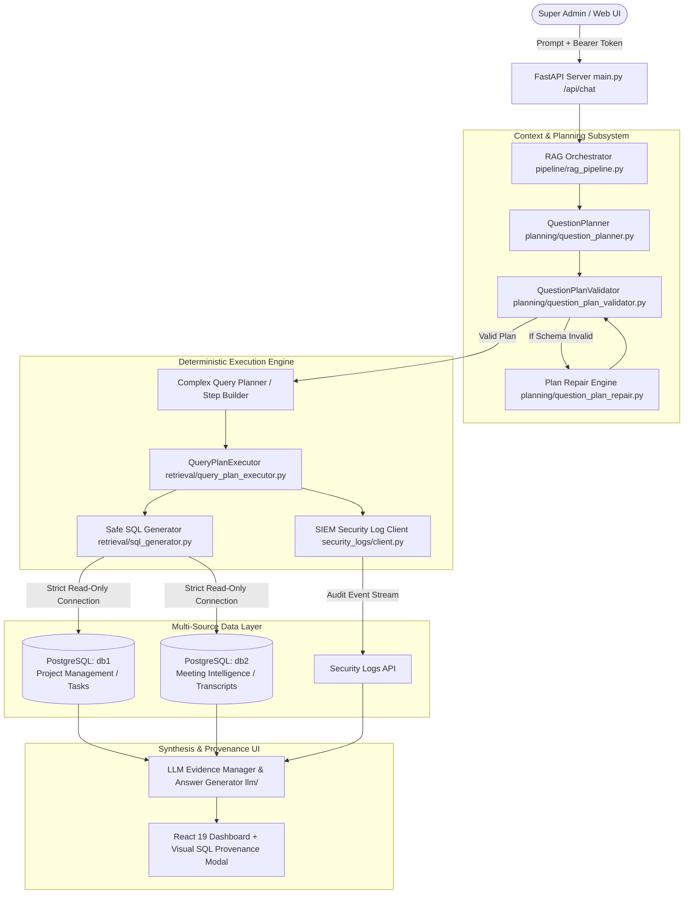

# CenarioCG — Context Layer & Multi-Source Intelligence Platform

<p align="center">
  
  
  
  
</p>

---

## 1. Executive Overview & Super Admin Purpose

**CenarioCG** is an enterprise-grade, agentic Retrieval-Augmented Generation (RAG) and Security Intelligence platform designed specifically for **Super Administrators, Executive Stakeholders, and Security Auditors**.

### The Problem It Solves
Modern digital operations and enterprise software deployments suffer from extreme data fragmentation:
- **Project Execution Data** (`db1`) lives in relational task management systems (tasks, sub-tasks, milestones, tickets, change orders, workspace bindings).
- **Meeting & Conversational Intelligence** (`db2`) lives in meeting analytics systems (sessions, transcripts, summaries, epics, action items, LLM token metrics).
- **Audit & Security Operations** (`security_logs`) live in external SIEM and CLI audit APIs.

Before CenarioCG, Super Admins had to manually navigate disjoint databases, write ad-hoc SQL, correlate disparate IDs across silos, and piece together project context from scattered meeting notes.

### The Super Admin Solution
CenarioCG unifies these heterogeneous systems into a single intelligent conversational cockpit:
1. **Natural-Language Cross-System Queries**: Ask questions that require multi-source synthesis, such as *"Show me recent projects and their latest meeting summaries"* or *"What action items were assigned to users on Project Test?"*.
2. **Interactive Context Graph**: Explore an interactive, force-directed graph (Cytoscape.js) that visualizes tables, foreign keys, business relationships, and cross-source linkages in real time.
3. **100% Visual SQL Provenance & Auditing**: Every answer includes interactive source badges (`DB1`, `DB2`, `Security Logs`). Clicking a badge opens an audit card displaying the exact parameterized SQL query, row counts, and matched data for complete institutional trust.
4. **Conversational Entity Continuity**: Seamlessly ask follow-up questions referencing people, projects, or meeting action items (e.g., *"Is Rahim Zahid a user?"*, *"Who is he?"*) without losing session state or context.
5. **Strict Zero-Risk Read-Only Guarantees**: Enterprise database safety enforced at the connection, syntax, and execution layers (`readonly=True`). Super Admins can query any operational data with zero risk of schema alteration, modification, or data corruption.

---

## 2. High-Level System Architecture



---

## 3. Directory & Module Breakdown

| Module / Directory | Path | Core Responsibilities |
|---|---|---|
| **API Server** | [`backend/main.py`](backend/main.py), [`backend/api/chat.py`](backend/api/chat.py) | FastAPI backend serving `/api/chat`, `/api/auth`, `/api/graph`. Manages session auth, cross-origin security, request validation, and Graph data formatting. |
| **RAG Pipeline** | [`backend/pipeline/rag_pipeline.py`](backend/pipeline/rag_pipeline.py) | Central orchestrator coordinating plan generation, plan validation, multi-source query execution, security logging, and answer generation. |
| **Query Planning** | [`backend/planning/question_planner.py`](backend/planning/question_planner.py)<br>[`backend/planning/question_plan_validator.py`](backend/planning/question_plan_validator.py)<br>[`backend/planning/complex_query_planner.py`](backend/planning/complex_query_planner.py) | LLM-driven query planner producing formal semantic contracts. Validates plans against the Context Layer and normalizes entity references. |
| **Safe SQL Engine** | [`backend/retrieval/sql_generator.py`](backend/retrieval/sql_generator.py)<br>[`backend/retrieval/query_plan_executor.py`](backend/retrieval/query_plan_executor.py) | Compiles plan contracts into parameterized SQL. Executes read-only queries with dynamic runtime parameter bindings across steps (`s1` $\rightarrow$ `s2`). |
| **Context Layer** | [`backend/context/context_store.py`](backend/context/context_store.py)<br>[`backend/context/context_graph.py`](backend/context/context_graph.py) | Discovers schema metadata, primary/foreign keys, and business relationships. Builds multi-source NetworkX graphs. |
| **Security Intelligence** | [`backend/security_logs/client.py`](backend/security_logs/client.py)<br>[`backend/security_logs/retriever.py`](backend/security_logs/retriever.py) | Read-only client for SIEM security logs, CLI audits, and workspace compliance summaries. |
| **Entity Resolution** | [`backend/entity_resolution/`](backend/entity_resolution/) | Extracts and maps codes (`AVID-4207`), emails, and entities across schema boundaries. |
| **Frontend Dashboard** | [`frontend/src/App.jsx`](frontend/src/App.jsx)<br>[`frontend/src/components/GraphView.jsx`](frontend/src/components/GraphView.jsx) | React 19 + Vite dashboard featuring Cytoscape force-directed graph view, conversational UI, and interactive SQL provenance modals. |

---

## 4. Available Data Sources & Schema Overview

### 🗄️ `db1` — Project Management & Operational Database
Houses project execution, task management, milestones, and workforce entities:
- **Core Tables**: `project_details`, `project_tasks`, `project_sub_tasks`, `project_milestones`, `tickets`, `project_change_orders`, `cde_workspaces`, `cde_provider_tasks`, `chat_rooms`, `recent_activities`, `users`, `roles`, `companies`, `company_contacts`, `project_stake_holders`.
- **Primary Keys**: `project_details.id` (UUID), `project_details.project_id_display` (e.g. `XAZM-9573`), `users.id`, `project_tasks.id`.

### 🧠 `db2` — Project Intelligence & Meeting Insights Database
Houses meeting transcripts, AI summaries, decisions, and system usage:
- **Core Tables**: `projects`, `meeting_summaries`, `action_items`, `sessions`, `transcripts`, `documents`, `epics`, `usage_llm_events`, `key_insights`, `users`.
- **Primary Keys**: `projects.id` (UUID), `projects.project_id` / `projects.project_code` (e.g. `XAZM-9573`), `sessions.id`, `meeting_summaries.meeting_id`.

### 🛡️ `security_logs` — SIEM & Security Audit API
Houses security and audit event records:
- **Resources**: `security_logs`, `cli_audit_logs`, `workspace_security_logs`, `workspace_siem_status`, `security_overview`.

---

## 5. UI Design System & Styling Tokens

The CenarioCG dashboard is engineered with a **bespoke, modern dark aesthetic** built on high-performance vanilla CSS, optimized for data density and executive decision-making.

### Design Tokens (`frontend/src/App.css`)
```css
:root {
  --bg: #0a0d12;              /* Deep obsidian dark background */
  --card: #12151b;            /* Elevation card layer 1 */
  --card-2: #171b22;          /* Elevation card layer 2 */

  --border: rgba(255, 255, 255, 0.08);
  --border-strong: rgba(255, 255, 255, 0.14);

  --text: #f1f5f9;            /* High-contrast primary typography */
  --text-2: #cbd5e1;          /* Secondary typography */
  --muted: #8b95a5;           /* Metadata / labels */

  --cyan: #0ea5e9;            /* Primary brand accent / DB1 badge */
  --green: #10b981;           /* Success / Verified SQL / Read-only */
  --purple: #8b5cf6;          /* Context Graph edges / DB2 badge */
  --amber: #f59e0b;           /* Warning / Security resource badge */
  --red: #f43f5e;             /* Error / Alert indicators */

  --radius: 18px;             /* Smooth card corners */
  --radius-sm: 12px;
}
```

### Key UI Features for Super Admins
- **Dual Visual Workspace**: Split layout featuring the conversational intelligence chat on one side and the interactive Context Graph on the other.
- **Cytoscape fCoSE Graph Engine**: Nodes colored by source database (`db1` = Cyan, `db2` = Purple), with smooth hover inspection, table column schema popups, and zoom/pan controls.
- **Interactive Provenance Badges**: Underneath every AI answer, interactive buttons appear for each data source queried. Clicking a button triggers a full visual modal displaying:
  - Source database and execution step ID.
  - Parameterized SQL query syntax.
  - Actual row counts and execution metrics.
  - Formatted preview of the retrieved database records.

---

## 6. Security Guarantees & Institutional Safety

1. **Strict Read-Only Database Connections**:
   All database sessions are initialized with explicit `readonly=True` parameter constraints. Even if an injection were attempted, PostgreSQL transactions enforce read-only status and abort any write operation.
2. **Deterministic Syntax Verification**:
   Before any query is dispatched to PostgreSQL, `validate_read_only_query()` inspects the AST (Abstract Syntax Tree) using `sqlglot` to verify that no `INSERT`, `UPDATE`, `DELETE`, `DROP`, `ALTER`, `TRUNCATE`, or `GRANT` statements are present.
3. **Dual-Mode Session Authentication**:
   The FastAPI server supports both `Authorization: Bearer <token>` and secure HttpOnly cookies, ensuring persistent login sessions across cross-origin deployments without credential leakage.
4. **Data Sanitization**:
   All responses and evidence records pass through `sanitize_api_response()` to prevent internal credential exposure and unauthorized metadata disclosure.

---

## 7. Installation & Quickstart

### Prerequisites
- Python 3.11+
- Node.js 18+ and npm
- PostgreSQL databases (`db1`, `db2`) with read credentials
- OpenAI API Key

### Step 1: Clone and Configure Environment
Create a `.env` file in the project root:
```ini
# PostgreSQL Data Source 1 (Project Management)
POSTGRES_HOST=your-db1-host.com
POSTGRES_PORT=5432
POSTGRES_DATABASE=defaultdb
POSTGRES_USER=your_user
POSTGRES_PASSWORD=your_password

# PostgreSQL Data Source 2 (Meeting Intelligence)
DB_HOST=your-db2-host.com
DB_PORT=5432
DB_USER=your_user
DB_PASSWORD=your_password
DB_NAME=your_db2_name

# LLM & Pipeline Configuration
OPENAI_API_KEY=sk-proj-your-key
OPENAI_MODEL=gpt-4o
CONTEXT_MAX_TURNS=5
CONTEXT_MAX_ITEMS=20
ALLOW_ORIGINS=http://localhost:5173,http://127.0.0.1:5173

# Security Logs SIEM API (Optional)
SECURITY_API_BASE_URL=https://your-security-api.com
SECURITY_API_PREFIX=api
SECURITY_API_TOKEN=your-jwt-token
```

### Step 2: Install Node.js Backend & Start Server
```powershell
# Navigate to backend directory
cd backend

# Install production Node.js dependencies
npm install

# Start the Node.js backend server
npm start
# (Or in development mode with auto-reload: npm run dev)
```
Backend will be live at `http://127.0.0.1:8000`.

*(Note: The original Python runtime is also preserved and can still be run via `python -m uvicorn main:app --host 127.0.0.1 --port 8000`)*

### Step 3: Install Frontend Dependencies & Start Dashboard
```powershell
cd frontend
npm install
npm run dev
```
Dashboard will be live at `http://127.0.0.1:5173`.

---

## 8. API Reference

| Endpoint | Method | Description | Sample Request / Output |
|---|---|---|---|
| `/api/auth/login` | `POST` | Authenticate Super Admin session. Returns session token. | `{"username": "...", "password": "..."}` |
| `/api/auth/me` | `GET` | Verify active session authentication status. | Returns `{"authenticated": true}` |
| `/api/auth/logout` | `POST` | End session and invalidate auth cookie. | Returns `{"authenticated": false}` |
| `/api/chat` | `POST` | Execute natural language query across multi-source RAG pipeline. | `{"question": "show me recent projects"}` |
| `/api/graph` | `GET` | Retrieve the unified Cytoscape Context Graph schema representation. | Returns nodes, edges, table columns, and relationships. |
| `/api/health` | `GET` | Health check probe. | Returns `{"status": "healthy"}` |

---

## 9. Security & Strict Read-Only Protections

The platform implements multi-layer defense-in-depth:
1. **Strict Read-Only Database Guards:**
   - PostgreSQL session level: Connections execute `SET SESSION CHARACTERISTICS AS TRANSACTION READ ONLY` on connect.
   - AST / Regex Guard: Blocks any `INSERT`, `UPDATE`, `DELETE`, `DROP`, `ALTER`, `TRUNCATE`, `MERGE`, `LOCK`, or `FOR UPDATE` statements.
   - Rejects multiple statements (semicolon injection protection).
2. **Confidentiality & Credential Shielding:**
   - Direct Inquiries Blocked: Prompts requesting passwords, secret tokens, private keys, or API credentials immediately fail closed.
   - Schema Filtering: Credential columns (`password`, `password_hash`, `api_key`, `token`) are automatically excluded from LLM planning prompts.
   - Output Sanitizer: Outbound text is continuously scanned and any accidental Bearer tokens or credentials are automatically replaced with `[REDACTED]`.

---

## 10. Testing & Quality Verification

Run the automated Node.js test suite across validation, SQL generation, security, and authentication:

```powershell
# From backend directory:
cd backend
npm test

# (Or run Node.js built-in test runner directly):
node --test tests/**/*.test.js
```
All 27 automated tests run with Node's native test runner (`node --test`).

---

## 11. Module-by-Module Migration Parity (Phase 1)

### `backend/config`
- Preserves full parity with `.env` settings and Python consumption.
- Automatically strips enclosing quotes from keys (e.g. `OPENAI_API_KEY`).
- Normalizes CORS `allowOrigins` to guarantee dual `localhost` / `127.0.0.1` access.
- Exposes complete SIEM cache TTLs, timeout limits, and Context Layer turn/item thresholds.

### `backend/auth`
- Implements constant-time timing-safe comparisons (`crypto.timingSafeEqual`) without length-mismatch throw vulnerabilities.
- Preserves multi-space Bearer token, raw dot token, and cookie extraction.
- Fully compatible with both padded and unpadded Base64/Base64URL HMAC SHA-256 session tokens.
- Restores `_get_cookie_settings` parity (`sameSite="none"` if secure, `"lax"` for local HTTP).

### `backend/api`
- Restores complete `graph_to_dict`, `build_graph_trace`, and `build_source_trace` serialization algorithms.
- Matches exact trace edge ID format: `${source}-${target}-${edgeKey}`.
- Preserves business, cross-source, and database relationship label precedence rules.
- Retains all 7 response keys on `/api/chat` (`question`, `answer`, `sources`, `graph`, `graph_summary`, `graph_trace`, `source_trace`).
- Preserves HTTP 400 and 401 status codes and error detail payloads.

### `backend/context`
- **`context_manager.js`**: Restores `ContextManager` conversational memory: bounded turn tracking (`addTurn`), entity retention across follow-up queries, text length capping, and `getPlanningContext` marking conversation history as reference-only.
- **`context_store.js`**: Restores `loadContext`, `loadAllContexts`, and `saveContext` with strict missing-file error propagation and DB1 legacy fallback.
- **`context_graph.js`**: Restores `buildContextGraph`, `getRelatedTables`, `getRelationships`, `MultiDiGraph` predecessor/successor traversal, parent -> child foreign key direction, and exact UI summary keys (`nodes`, `edges`).
- **`business_logic_store.js`**: Dedicated modular store for loading and persisting validated business relationships partitioned by `source_id`.
- **`business_logic_validator.js`**: Deterministic schema validation for candidate business relationships verifying table/column presence, confidence range, and evidence.
- **`business_logic_inference.js` & `business_logic_pipeline.js`**: LLM relationship inference and automated validation pipeline.
- **`context_builder.js`**: Read-only schema discovery compiler constructing `context_db1.json` and `context_db2.json` directly from PostgreSQL metadata.
- **`cross_source_inference.js`, `cross_source_evidence.js`, `cross_source_business_logic.js`**: Multi-source relationship candidate generation, cryptographic value-hash evidence collection, and deterministic validation rules.

---

<p align="center">

  <b>CenarioCG Context Layer</b> — Empowering Super Administrators with authoritative, safe, multi-source intelligence.
</p>

